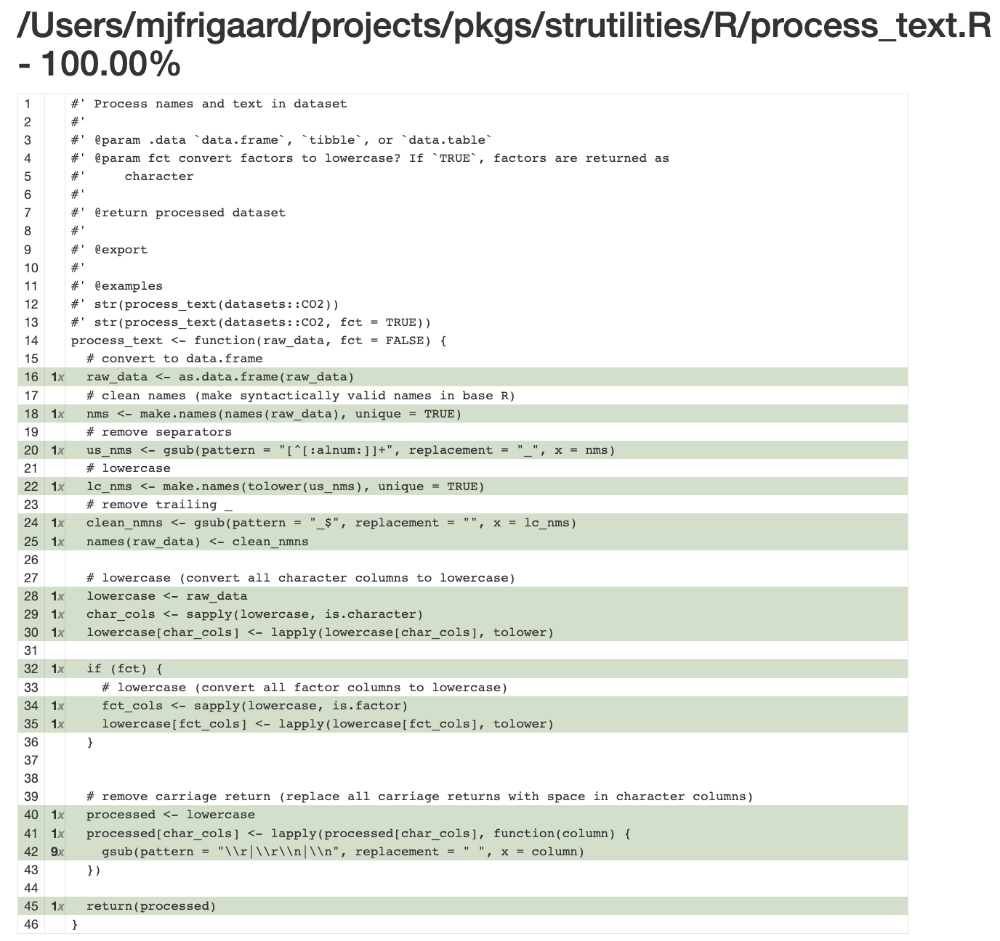

<!-- README.md is generated from README.Rmd. Please edit that file -->

```{r, include = FALSE}
knitr::opts_chunk$set(
  collapse = TRUE,
  comment = "#>",
  fig.path = "man/figures/README-",
  out.width = "80%",
  fig.align = 'center'
)
```

# `strutilities`

<!-- badges: start -->
<!-- badges: end -->

The goal of `strutilities` is to perform obscure string manipulations.

## Installation

You can install the development version of strutilities like so:

``` r
install.packages('pak')
pak::pak('mjfrigaard/strutilities')
```

## Functions

`strutilities` has three functions (`sep_cols_mult()`, `process_text()` and `pivot_term_long()`). 

```{r example}
library(strutilities)
```

Each function has been written in base R (to keep dependencies low).

## sep_cols_mult()

```{r}
d <- data.frame(value = c(29L, 91L, 39L, 28L, 12L),
                full_name = c("John", "John, Jacob",
                         "John, Jacob, Jingleheimer",
                         "Jingleheimer, Schmidt",
                         "JJJ, Schmidt"))
d
sep_cols_mult(data = d, col = "full_name", col_prefix = "name")
```

## process_text()

```{r}
names(datasets::iris)
names(process_text(datasets::iris))
```

```{r}
str(datasets::InsectSprays)
str(process_text(datasets::InsectSprays, fct = TRUE))
```

## pivot_term_long()

```{r}
pivot_term_long("A large size in stockings is hard to sell.")
```

```{r}
terms <- c("A large size in stockings is hard to sell.", "The first part of the plan needs changing.")
pivot_term_long(terms)
```

## Testing 

```{r , echo=FALSE}
fs::dir_tree("tests")
```


### Helper with fixture

This test loads the fixture (`tests/testthat/fixtures/test_data.rds`) and uses the `test_logger()` helper in (`tests/testthat/helper.R`)

```{r , eval=FALSE}
describe(
"Feature: Process text from dataset
    As a ...
    I want to ...
    So that I ...", code = {
  it(
   "Scenario: scenario
     Given ...
     When ...
     Then ...", code = {
   # helper
   test_logger(start = "process_text()", msg = "names penguins_raw.csv")
   # fixture
    test_data <- readRDS(test_path("fixtures", "test_data.rds"))
    # test data
    processed_data <- process_text(raw_data = test_data, fct = TRUE)
    # expected names
    nms <- c("studyname",
            "sample_number",
            "species",
            "region",
            "island",
            "stage",
            "individual_id",
            "clutch_completion",
            "date_egg",
            "culmen_length_mm",
            "culmen_depth_mm",
            "flipper_length_mm",
            "body_mass_g",
            "sex",
            "delta_15_n_o_oo",
            "delta_13_c_o_oo",
            "comments")
    expect_equal(object = names(processed_data), expected = nms)
    test_logger(end = "process_text()", msg = "names penguins_raw.csv")
  })
})
```

#### devtools:::test_active_file()

```
[ FAIL 0 | WARN 0 | SKIP 0 | PASS 0 ]
INFO [2023-11-09 14:59:57] [ START process_text() = names penguins_raw.csv]
[ FAIL 0 | WARN 0 | SKIP 0 | PASS 1 ]
INFO [2023-11-09 14:59:57] [ END process_text() = names penguins_raw.csv]
```

#### devtools:::test_coverage_active_file()

```{r coverage_fixture.png, echo=FALSE}
knitr::include_graphics("man/figures/coverage_fixture.png")
```

### Helper without fixture

This test loads the data from `palmerpenguins` directly (not using fixture), but also uses the helper. 

```{r , eval=FALSE}
describe(
"Feature: Process text from dataset
    As a ...
    I want to ...
    So that I ...", code = {
  it(
   "Scenario: scenario
     Given ...
     When ...
     Then ...", code = {
   # helper
   test_logger(start = "process_text()", msg = "names palmerpenguins::penguins_raw")
   # data frame package
    test_data <- palmerpenguins::penguins_raw
    # test
    processed_data <- process_text(raw_data = test_data, fct = TRUE)
    nms <- c("studyname",
            "sample_number",
            "species",
            "region",
            "island",
            "stage",
            "individual_id",
            "clutch_completion",
            "date_egg",
            "culmen_length_mm",
            "culmen_depth_mm",
            "flipper_length_mm",
            "body_mass_g",
            "sex",
            "delta_15_n_o_oo",
            "delta_13_c_o_oo",
            "comments")
    expect_equal(object = names(processed_data), expected = nms)
    test_logger(end = "process_text()", msg = "names palmerpenguins::penguins_raw")
  })
})
```

#### devtools:::test_active_file()

```
[ FAIL 0 | WARN 0 | SKIP 0 | PASS 0 ]
INFO [2023-11-09 15:03:36] [ START process_text() = names palmerpenguins::penguins_raw]
[ FAIL 0 | WARN 0 | SKIP 0 | PASS 1 ]
INFO [2023-11-09 15:03:36] [ END process_text() = names palmerpenguins::penguins_raw]
```

#### devtools:::test_coverage_active_file()

```{r coverage_helper.png, echo=FALSE}

```


 

