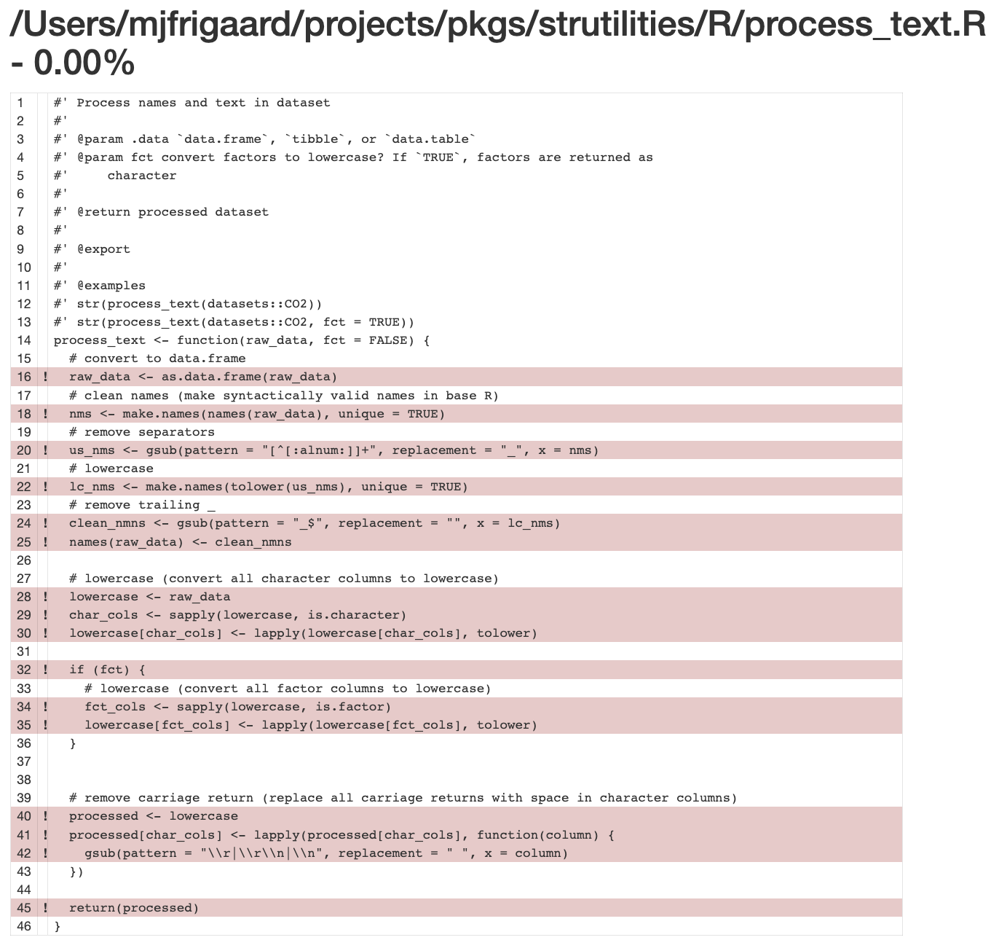
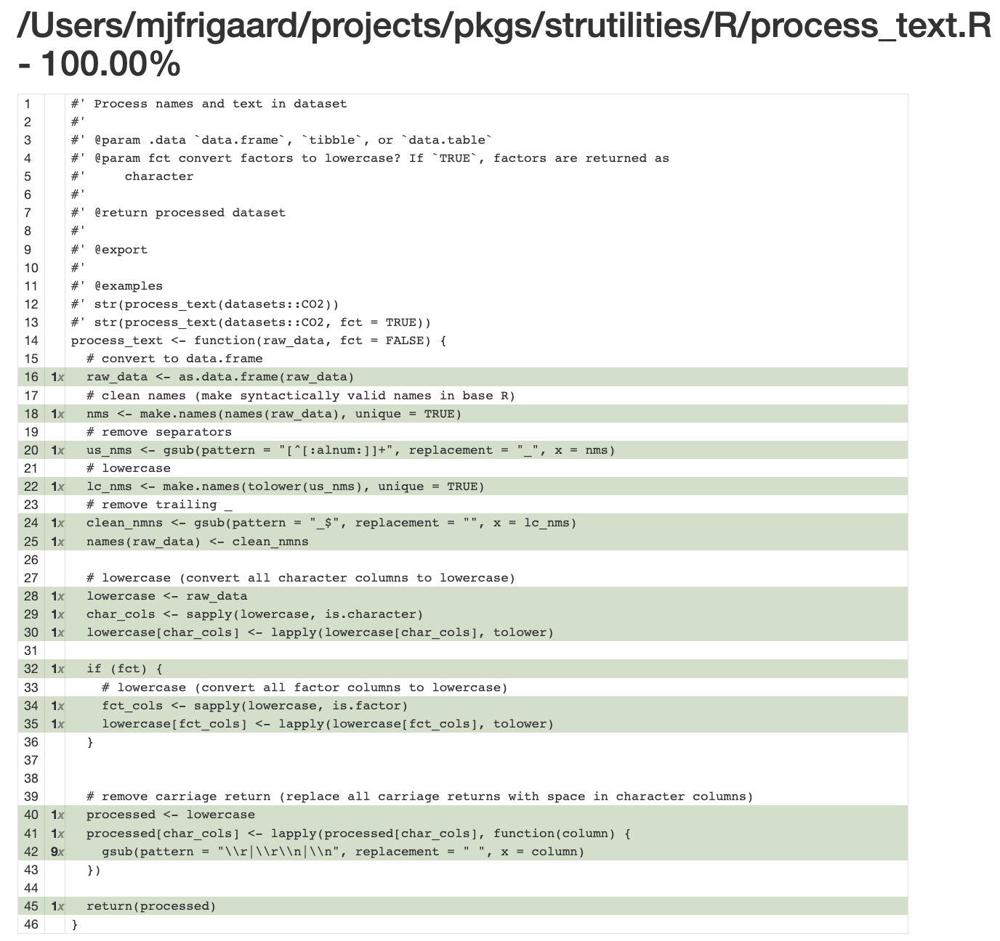

<!-- README.md is generated from README.Rmd. Please edit that file -->

# `strutilities`

<!-- badges: start -->
<!-- badges: end -->

The goal of `strutilities` is to perform obscure string manipulations.

## Installation

You can install the development version of strutilities like so:

``` r
install.packages('pak')
pak::pak('mjfrigaard/strutilities')
```

``` r
library(strutilities)
```

## process_text()

`process_text()` is designed to standardize the columns names and text
contents in a dataset (sort of a low-budget combination of a
`janitor::clean_names()` and `map(df, tolower)`):

``` r
names(datasets::iris)
#> [1] "Sepal.Length" "Sepal.Width"  "Petal.Length" "Petal.Width"  "Species"
names(process_text(datasets::iris))
#> [1] "sepal_length" "sepal_width"  "petal_length" "petal_width"  "species"
```

It has an optional `fct` argument that will convert factors to lowercase
characters, too.

``` r
str(datasets::InsectSprays)
#> 'data.frame':    72 obs. of  2 variables:
#>  $ count: num  10 7 20 14 14 12 10 23 17 20 ...
#>  $ spray: Factor w/ 6 levels "A","B","C","D",..: 1 1 1 1 1 1 1 1 1 1 ...
str(process_text(datasets::InsectSprays, fct = TRUE))
#> 'data.frame':    72 obs. of  2 variables:
#>  $ count: num  10 7 20 14 14 12 10 23 17 20 ...
#>  $ spray: chr  "a" "a" "a" "a" ...
```

## Testing

Below you’ll find the structure of the `tests/` folder:

    #> tests
    #> ├── testthat
    #> │   ├── _snaps
    #> │   ├── fixtures
    #> │   │   ├── make-test_data.R
    #> │   │   └── test_data.rds
    #> │   ├── helper.R
    #> │   ├── setup.R
    #> │   ├── test-pivot_term_long.R
    #> │   ├── test-process_text.R
    #> │   └── test-sep_cols_mult.R
    #> └── testthat.R

### Helper with fixture (issue)

In the test below, the `process_text()` function uses the source .csv
version of `palmerpenguins::penguins_raw` as a test fixture (loaded in
from `tests/testthat/fixtures/make-test_data.rds` and exported to
`tests/testthat/fixtures/test_data.rds`)

The test helper function (`test_logger()`) is stored in
`tests/testthat/helper.R`:

``` r
describe(
"Feature: Process text from dataset
    As a ...
    I want to ...
    So that I ...", code = {
  it(
   "Scenario: scenario
     Given ...
     When ...
     Then ...", code = {
   # helper
   test_logger(start = "process_text()", msg = "names penguins_raw.csv")
   # fixture
    test_data <- readRDS(test_path("fixtures", "test_data.rds"))
    # observerd data
    processed_data <- process_text(raw_data = test_data, fct = TRUE)
    # expected names
    nms <- c("studyname",
            "sample_number",
            "species",
            "region",
            "island",
            "stage",
            "individual_id",
            "clutch_completion",
            "date_egg",
            "culmen_length_mm",
            "culmen_depth_mm",
            "flipper_length_mm",
            "body_mass_g",
            "sex",
            "delta_15_n_o_oo",
            "delta_13_c_o_oo",
            "comments")
    expect_equal(object = names(processed_data), expected = nms)
    test_logger(end = "process_text()", msg = "names penguins_raw.csv")
  })
})
```

#### devtools:::test_active_file()

As we can see below, the test runs fine (with the helper).

    [ FAIL 0 | WARN 0 | SKIP 0 | PASS 0 ]
    INFO [2023-11-09 14:59:57] [ START process_text() = names penguins_raw.csv]
    [ FAIL 0 | WARN 0 | SKIP 0 | PASS 1 ]
    INFO [2023-11-09 14:59:57] [ END process_text() = names penguins_raw.csv]

#### devtools:::test_coverage_active_file()

However, when I attempt to get the coverage for the test file, it shows
0.00% :(



I thought it might be `it()`, so I swapped it for `test_that()`, but
‘same same’ :(

### Helper without fixture (works!)

To make sure it wasn’t the `process_text()` function or the helper, I
also tested loading the `penguins_raw` data directly from the
`palmerpenguins` package (i.e., not using the fixture):

``` r
describe(
"Feature: Process text from dataset
    As a ...
    I want to ...
    So that I ...", code = {
  it(
   "Scenario: scenario
     Given ...
     When ...
     Then ...", code = {
   # helper
   test_logger(start = "process_text()", msg = "names palmerpenguins::penguins_raw")
   # data frame package
    test_data <- palmerpenguins::penguins_raw
    # test
    processed_data <- process_text(raw_data = test_data, fct = TRUE)
    nms <- c("studyname",
            "sample_number",
            "species",
            "region",
            "island",
            "stage",
            "individual_id",
            "clutch_completion",
            "date_egg",
            "culmen_length_mm",
            "culmen_depth_mm",
            "flipper_length_mm",
            "body_mass_g",
            "sex",
            "delta_15_n_o_oo",
            "delta_13_c_o_oo",
            "comments")
    expect_equal(object = names(processed_data), expected = nms)
    test_logger(end = "process_text()", msg = "names palmerpenguins::penguins_raw")
  })
})
```

#### devtools:::test_active_file()

    [ FAIL 0 | WARN 0 | SKIP 0 | PASS 0 ]
    INFO [2023-11-09 15:03:36] [ START process_text() = names palmerpenguins::penguins_raw]
    [ FAIL 0 | WARN 0 | SKIP 0 | PASS 1 ]
    INFO [2023-11-09 15:03:36] [ END process_text() = names palmerpenguins::penguins_raw]

#### devtools:::test_coverage_active_file()



## Other functions

`strutilities` has two other weird functions (`sep_cols_mult()` and
`pivot_term_long()`) for manipulating strings/character columns (all
written in base R to keep dependencies at a minimum).

### pivot_term_long()

This is an odd version of `pivot_wider()` that’s been adapted for a
vectors:

``` r
pivot_term_long("A large size in stockings is hard to sell.")
#>   unique_items                                       term
#> 1            A A large size in stockings is hard to sell.
#> 2        large                                       <NA>
#> 3         size                                       <NA>
#> 4           in                                       <NA>
#> 5    stockings                                       <NA>
#> 6           is                                       <NA>
#> 7         hard                                       <NA>
#> 8           to                                       <NA>
#> 9         sell                                       <NA>
```

You can pass multiple ‘terms’ and it returns a data.frame with each
unique term:

``` r
terms <- c("A large size in stockings is hard to sell.", "The first part of the plan needs changing.")
pivot_term_long(terms)
#>    unique_items                                       term
#> 1             A A large size in stockings is hard to sell.
#> 2         large                                       <NA>
#> 3          size                                       <NA>
#> 4            in                                       <NA>
#> 5     stockings                                       <NA>
#> 6            is                                       <NA>
#> 7          hard                                       <NA>
#> 8            to                                       <NA>
#> 9          sell                                       <NA>
#> 10          The The first part of the plan needs changing.
#> 11        first                                       <NA>
#> 12         part                                       <NA>
#> 13           of                                       <NA>
#> 14          the                                       <NA>
#> 15         plan                                       <NA>
#> 16        needs                                       <NA>
#> 17     changing                                       <NA>
```

## sep_cols_mult()

The is *somewhat* similar to `tidyr::separate()`, but always uses
`"[^[:alnum:]]+"` as the `sep` and keeps all the items resulting from
the regex.

``` r
d <- data.frame(value = c(29L, 91L, 39L, 28L, 12L),
                full_name = c("John", "John, Jacob",
                         "John, Jacob, Jingleheimer",
                         "Jingleheimer, Schmidt",
                         "JJJ, Schmidt"))
d
#>   value                 full_name
#> 1    29                      John
#> 2    91               John, Jacob
#> 3    39 John, Jacob, Jingleheimer
#> 4    28     Jingleheimer, Schmidt
#> 5    12              JJJ, Schmidt
sep_cols_mult(data = d, col = "full_name", col_prefix = "name")
#>   value                 full_name       name_1  name_2       name_3
#> 1    29                      John         John    <NA>         <NA>
#> 2    91               John, Jacob         John   Jacob         <NA>
#> 3    39 John, Jacob, Jingleheimer         John   Jacob Jingleheimer
#> 4    28     Jingleheimer, Schmidt Jingleheimer Schmidt         <NA>
#> 5    12              JJJ, Schmidt          JJJ Schmidt         <NA>
```
